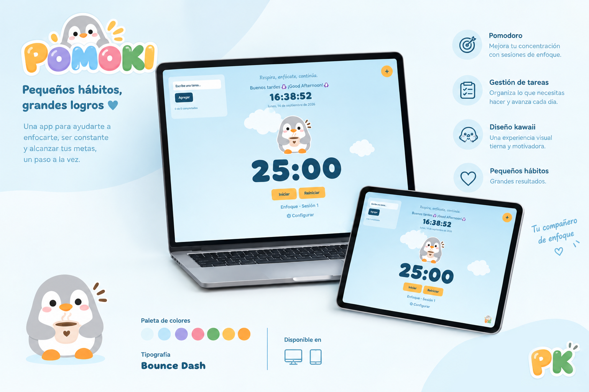

<p align="center">
  
</p>

<h1 align="center">POMOKI 🐧</h1>

<p align="center">
  Una app de productividad tipo Pomodoro con checklist y notas post-it, construida en JavaScript vanilla mientras aprendía a programar.
</p>

<p align="center">
  <a href="https://saileamarcano.github.io/Pomoki/"><strong>Ver demo »</strong></a>
</p>

---

## Sobre el proyecto

POMOKI nació como un ejercicio para practicar lo que iba aprendiendo en JavaScript y terminó convirtiéndose en una app completa que uso a diario para organizarme. Combina un temporizador Pomodoro, una checklist de tareas y notas post-it, todo con una mascota (un pingüino) que reacciona según el estado del temporizador.

Está construida sin frameworks — JavaScript, HTML y CSS puro — y empaquetada como aplicación de escritorio con Electron.

## ✨ Características

- ⏱️ **Temporizador Pomodoro** — ciclos de enfoque y descanso configurables, con conteo de sesiones y aviso sonoro al cambiar de fase.
- ✅ **Checklist de tareas** — agregar, completar, editar y eliminar tareas, con contador de progreso.
- 📝 **Notas post-it** — se crean, se arrastran a cualquier parte de la pantalla, cambian de color y tienen nivel de prioridad.
- 🕐 **Reloj y saludo dinámico** — muestra la hora, la fecha y un saludo según el momento del día.
- 🔔 **Alerta de inactividad** — si pasa mucho tiempo sin interactuar, un aviso invita a retomar el foco.
- 🐧 **Mascota animada** — el pingüino cambia de expresión (enfocado, inactivo, durmiendo, enojado) según el estado del temporizador.
- 💾 **Persistencia local** — tareas y notas se guardan con `localStorage`, así que no se pierden al cerrar la app.

## 📸 Capturas

> _Agrega aquí una o dos capturas reales de la app en uso (por ejemplo el temporizador corriendo y la checklist con tareas) para mostrar la interfaz final._

## 🛠️ Tecnologías

- JavaScript (vanilla, sin frameworks)
- HTML5 & CSS3
- [Electron](https://www.electronjs.org/) — empaquetado como app de escritorio
- `localStorage` — persistencia de datos

## 🚀 Cómo correrlo localmente

```bash
# Clonar el repositorio
git clone https://github.com/SaileAMarcano/Pomoki.git

# Entrar a la carpeta del proyecto
cd Pomoki

# Abrir index.html en el navegador
# (o, si está configurado con Electron, instalar dependencias y correr la app)
npm install
npm start
```

## 🗺️ Roadmap

- [ ] Calendario integrado para organizar los post-its
- [ ] Texto enriquecido en las notas (negrita, itálica, color)
- [ ] Temas visuales personalizables
- [ ] Versión adaptada para móvil

## 👩‍💻 Autora

**Saile Adriana Marcano Mejías**

- LinkedIn: [linkedin.com/in/saile-adriana-marcano-mejias](https://www.linkedin.com/in/saile-adriana-marcano-mejias-656b22327/)
- GitHub: [@SaileAMarcano](https://github.com/SaileAMarcano)

---

<p align="center">Hecho con 🧊 y mucho café por un pingüino programador.</p>
